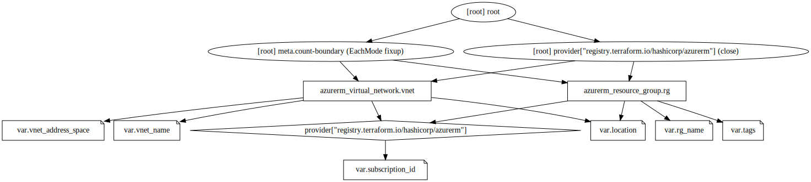
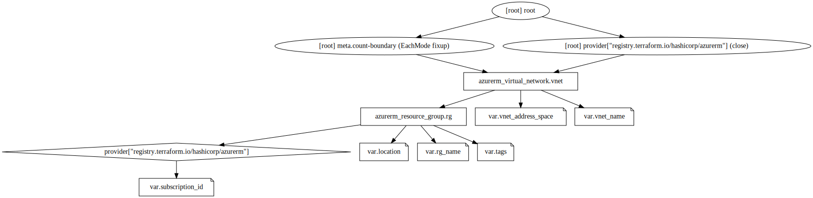
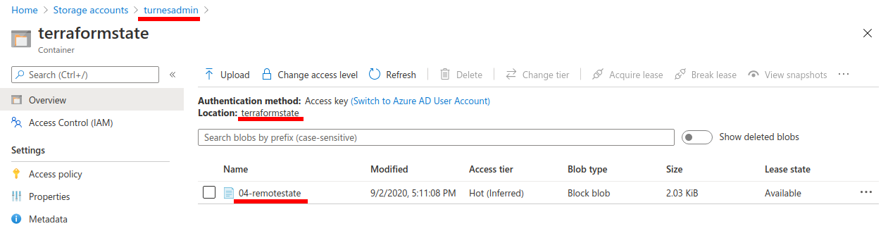

## How to use
Each folder is a project. In each project you should create `terraform.tfvars` file. The content of this contains sensitive data, so never publish it in github.

For security reasons some variables in `variables.tf` are not assigned, you need to write down in `terraform.tfvars` or use other [methods](https://www.terraform.io/docs/configuration/variables.html#assigning-values-to-root-module-variables)

Ex:
**`variables.tf`**
``` terraform
variable "subscription_id" {
  type = string  
}

variable "region" {
  type = string
}

variable "rg_name" {
  type = string
}
```
Your **`terraform.tfvars`** should be

``` terraform
subscription_id = "your_subscription_id"
region = "westus2"
rg_name = "learning-tf"

```


## Useful AZ commands

```
# S U B S C R I P T I O N S
az account list -o table
az account show
az account set subscription_id

# R E G I O N S
az account list-locations -o table

# V I R T U A L  M A C H I N E S
az vm list-sizes -l westus-2 -o table

# I M A G E S
az vm image list-publishers -l westus2
az vm image list-offers -l westus2 -p Canonical -o table
az vm image list-skus -l westus2 -p Canonical --offer UbuntuServer -o table

```


## Scenario 1
## Scenario 2
## Scenario 3
```
sudo apt-get install graphviz
terraform graph | dot -Tsvg > graph.svg
```
#### No dependency

### Implicit and Explicit Dependency


## Scenario 4
* Create a storage account
* Create a container
* Create a file terraform.tf (it can be any name) inside of project.

``` terraform
terraform {
    backend "azurerm" {
    resource_group_name     = "rs-admin"
    storage_account_name    = "turnesadmin"
    container_name          = "terraformstate"
    key                     = "04-remotestate"  # state file name
  }
}
```

